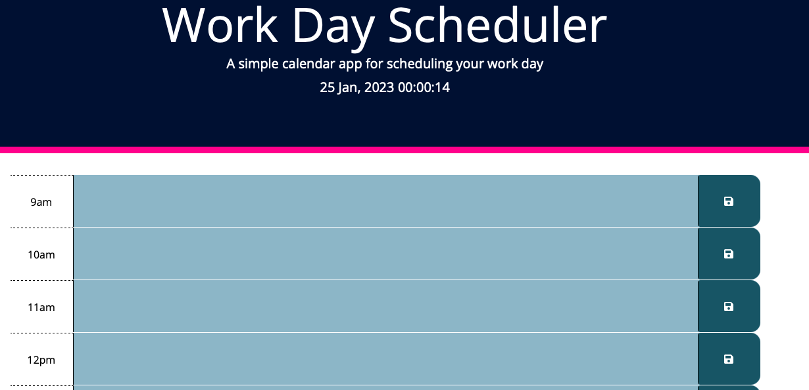

# Work Day Schedular

## The Task:

* I have been tasked with creating a simple calendar application that allows users to save events for each hour of the day.

* This app features dynamically updated HTML and CSS.

**Instructions**

* Create an app that meets the following criteria:

    * Display the current day at the top of the calender when a user opens the planner.
 
    * Present timeblocks for standard business hours when the user scrolls down.
 
    * Color-code each timeblock based on past, present, and future when the timeblock is viewed.
 
    * Allow a user to enter an event when they click a timeblock

    * Save the event in local storage when the save button is clicked in that timeblock.

    * Persist events between refreshes of a page

## Installation

To run, simply open the following link in your web browser and add events to your daily schedule. Events that you add will be save to your local storage so they will remain on the app when you refresh, close and re-open the app.

You can access the calendar app through the following link:

https://shaky411.github.io/Work-Day-Scheduler

## Usage

## Screenshots

## Credits

N/A

## License

Please refer to the license in the repo.